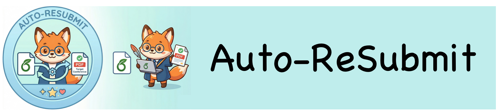

<div align="center">
  

<p><strong>面向会议重投的 LaTeX 模板无损迁移工具。</strong></p>

<p>
  
  
  
  
  
  
  
  
  
</p>

<p><strong>支持这些会议家族之间的相互转换</strong></p>

<p><code>源论文 Zip</code> → <code>Auto-Resubmit 自动迁移</code> → <code>目标会议模板 Zip</code></p>

<p>
  <a href="README.md">English</a> ·
  <a href="SUPPORT_MATRIX.md">支持矩阵</a>
</p>

<p>
  
  
  
</p>
</div>

## 项目简介 🧭

Auto-Resubmit 用来把源 LaTeX 论文项目 zip 迁移到目标会议模板 zip，同时尽量保持论文内容不变。

它主要解决 ACL、EMNLP、NeurIPS、NIPS、ICML、ICLR、CVPR、ICCV、AAAI 等会议家族之间的重投模板迁移问题：

- 读取源论文项目 zip
- 读取目标会议模板 zip
- 自动识别主稿入口
- 抽取标题、摘要、正文、参考文献块、附录和所需宏定义
- 按目标会议模板家族重新组装论文
- 复制图片、`.bib` 和本地资源
- 编译并打包输出

## 当前支持的会议家族 🔁

| 家族 | 会议别名 |
| --- | --- |
| ACL 家族 | `acl`, `emnlp` |
| NeurIPS 家族 | `neurips`, `nips` |
| ICML 家族 | `icml` |
| ICLR 家族 | `iclr` |
| CVPR 家族 | `cvpr`, `iccv` |
| AAAI 家族 | `aaai` |

详细说明见 [SUPPORT_MATRIX.md](SUPPORT_MATRIX.md)

## 安装 ⚙️

### 环境要求

- Python `3.10+`
- `pip`
- `tectonic`

### Python 依赖说明

这个项目当前只使用 Python 标准库。

- 第三方 Python 包依赖：无
- 真正需要额外安装的外部工具：`tectonic`

`python -m pip install --editable .` 的作用主要是把当前仓库这个本地项目安装到环境里，并注册 `auto_resubmit` 这个命令行入口。

### 方式一：使用 `conda`

```bash
git clone https://github.com/LilanOvO/Auto-Resubmit.git
cd Auto-Resubmit

conda create -n auto-resubmit python=3.10 -y
conda activate auto-resubmit
python -m pip install --editable .
```

### 方式二：使用 `venv`

```bash
python -m venv .venv
source .venv/bin/activate
python -m pip install --editable .
```

如果你不需要可编辑模式，也可以直接用：

```bash
python -m pip install .
```

### 安装 `tectonic`

`tectonic` 需要单独安装。安装完成后，下面这个命令应该可以正常输出版本号：

```bash
tectonic --version
```

常见安装方式：

```bash
# conda
conda install -c conda-forge tectonic
```

```bash
# cargo
cargo install tectonic
```

```bash
# macOS
brew install tectonic
```

如果没有 `tectonic`，项目仍然可以生成转换后的 LaTeX 工程，但不会输出最终 PDF。

### 安装完成后的检查

执行完 `pip install --editable .` 之后，下面两个命令至少应该有一个能正常工作：

```bash
auto_resubmit --help
```

```bash
python -m auto_resubmit --help
```

## 快速开始 🚀

```bash
auto_resubmit run \
  --source-zip /path/to/source-paper.zip \
  --target-template-zip /path/to/target-template.zip \
  --output-dir /path/to/output-dir
```

如果 shell 里找不到 `auto_resubmit`，可以直接改用：

```bash
python -m auto_resubmit run \
  --source-zip /path/to/source-paper.zip \
  --target-template-zip /path/to/target-template.zip \
  --output-dir /path/to/output-dir
```

## 输出内容 📦

运行成功后，输出目录通常包含：

- `converted_project.zip`
- `converted_project/resubmitted.tex`
- `converted_project/resubmitted.pdf`
- `conversion_manifest.json`
- `content_audit.json`
- `converted_project/tectonic.log`

## 输入建议 📝

- 源输入应为 LaTeX 项目 zip，而不是 PDF
- 目标输入应为官方会议模板 zip
- 源 zip 最好只包含一个真正的主稿入口
- 图片、`.bib`、本地 `.sty` 等依赖文件应一并打包
- 依赖私有脚本或缺失外部资源的项目不在当前支持范围内

## 常见问题 🩺

- `auto_resubmit: command not found`
  先执行 `python -m auto_resubmit --help`。如果这个命令正常，说明环境没问题，只是 shell 入口没有生效。
- `compiler: not_found`
  说明系统里没有安装 `tectonic`，或者它不在 `PATH` 里。
- `pdf_path: not_generated`
  说明 LaTeX 工程已经生成，但 PDF 编译失败。请查看 `converted_project/tectonic.log`。
- 第一次运行 `tectonic` 比较慢
  这是正常现象。`tectonic` 首次运行时可能需要建立本地缓存。

## Star History ⭐

[](https://star-history.com/#LilanOvO/Auto-Resubmit&Date)

## 后续计划 🛣️

这个仓库目前还是 Auto-Resubmit 的初步版本。

我后续希望把它继续做成一个多 agent 系统，能够：

- 自动识别审稿意见里真正有价值、可执行的部分
- 基于上一会的论文自动完成进一步优化和修改
- 在内容更新后，把论文更完整、更稳定地迁移到目标会议模板

如果你对这个方向感兴趣，欢迎一起合作、加入 contributor。联系邮箱：`zjuqww@gmail.com`
