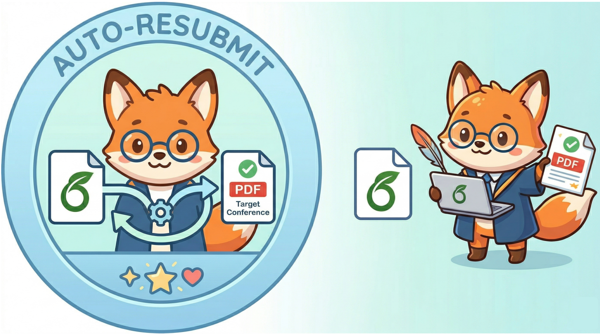

<div align="center">
  

# Auto-Resubmit

<p><strong>面向会议重投的 LaTeX 模板无损迁移工具。</strong></p>

<p>
  <a href="README.md">English</a> ·
  <a href="SUPPORT_MATRIX.md">支持矩阵</a>
</p>

<p>
  
  
  
</p>
</div>

## 项目简介

Auto-Resubmit 用来把源 LaTeX 论文项目 zip 迁移到目标会议模板 zip，同时尽量保持论文内容不变。

它主要解决重投场景里的模板迁移问题：

- 读取源论文项目 zip
- 读取目标会议模板 zip
- 自动识别主稿入口
- 抽取标题、摘要、正文、参考文献块、附录和所需宏定义
- 按目标会议模板家族重新组装论文
- 复制图片、`.bib` 和本地资源
- 编译并打包输出

## 当前支持的会议家族

| 家族 | 会议别名 |
| --- | --- |
| ACL 家族 | `acl`, `emnlp` |
| NeurIPS 家族 | `neurips`, `nips` |
| ICML 家族 | `icml` |
| ICLR 家族 | `iclr` |
| CVPR 家族 | `cvpr`, `iccv` |
| AAAI 家族 | `aaai` |

详细说明见 [SUPPORT_MATRIX.md](SUPPORT_MATRIX.md)

## 安装

- Python 3.10+
- 可用的 `tectonic` 编译器，用于生成 PDF

先创建并安装 Python 环境：

```bash
python -m venv .venv
source .venv/bin/activate
pip install --upgrade pip
pip install -e .
```

再确认 LaTeX 编译器可用：

```bash
tectonic --version
```

## 快速开始

```bash
PYTHONPATH=src python -m auto_resubmit run \
  --source-zip /path/to/source-paper.zip \
  --target-template-zip /path/to/target-template.zip \
  --output-dir /path/to/output-dir
```

## 输出内容

运行成功后，输出目录通常包含：

- `converted_project.zip`
- `converted_project/resubmitted.tex`
- `converted_project/resubmitted.pdf`
- `conversion_manifest.json`
- `content_audit.json`
- `converted_project/tectonic.log`

## 输入建议

- 源输入应为 LaTeX 项目 zip，而不是 PDF
- 目标输入应为官方会议模板 zip
- 源 zip 最好只包含一个真正的主稿入口
- 图片、`.bib`、本地 `.sty` 等依赖文件应一并打包
- 依赖私有脚本或缺失外部资源的项目不在当前支持范围内

## 验证脚本

检查一个源项目在所有支持家族上的转换情况：

```bash
PYTHONPATH=src python tools/validate_supported_families.py \
  --source-zip /path/to/source-paper.zip \
  --output-dir outputs/supported-families
```

运行家族两两互转验证：

```bash
PYTHONPATH=src python tools/validate_mutual_families.py \
  --seed-source-zip /path/to/source-paper.zip \
  --output-dir outputs/mutual-matrix
```

把生成的 PDF 渲染成逐页缩略图，方便人工检查：

```bash
python tools/render_pdf_contact_sheets.py \
  --input-dir outputs/mutual-matrix \
  --output-dir outputs/contact-sheets \
  --clean
```

## Star History

[](https://star-history.com/#LilanOvO/Auto-Resubmit&Date)
